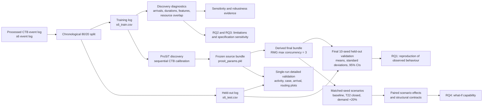

# Truck simulation pipeline, outcome files, and quality measures

This guide explains what the pipeline produces, which files should be used for the thesis, and how the reported quality measures should be read.

## The main distinction

The result folders answer three different questions:

1. **Discovery diagnostics:** Did the discovery methods learn reasonable arrival, duration, routing, and resource patterns from the training data?
2. **Held-out validation:** Does one frozen ProSiT model reproduce the unseen 20% test log?
3. **Scenario analysis:** What changes inside this frozen model when an input is changed?

Scenario results are model results. They are not independent proof that the same causal effect would occur at the real terminal.

## Pipeline overview

## Which result folders are current?

### Final thesis evidence

- **Discovery source:** `../trucksimulation/baseline/discovery_params/params_20260816_214403_train80/prosit_discovery_workload_sequential_calibrated/`
- **Final held-out validation:** `../trucksimulation/validation/results/prosit_sequential_calibrated_rmg_cap3_vs_holdout_ci/`
- **Final scenarios:** `../trucksimulation/validation/results/prosit_sequential_calibrated_scenarios_rmg_cap3_ci/`
- **Temporal split:** `../trucksimulation/validation/results/split_manifest.json`

### Supporting detailed results

- **Single-run validation with detailed activity and distribution files:** `../trucksimulation/validation/results/prosit_sequential_calibrated_vs_holdout/`
- **Percentile sensitivity:** `../trucksimulation/validation/results/percentile_sensitivity/`
- **Receive/delivery utilisation:** `../trucksimulation/validation/results/receive_delivery_utilisation/`
- **Context-rule audit:** `../trucksimulation/validation/results/prosit_context_rule_audit/`

The folders named `prosit_train80_*`, older timestamped validation folders, and the uncapped `prosit_sequential_calibrated_scenarios_ci` folder are development, screening, or diagnostic runs. They should not replace the final cap-3 validation and scenario folders in the thesis.

## The files to open first

| Order | File | What it tells you |
|---:|---|---|
| 1 | `validation/results/split_manifest.json` | How the full log was split; case and event counts; cutoff date; leakage checks. |
| 2 | `.../prosit_discovery_workload_sequential_calibrated/prosit_run_summary.json` | Discovery inputs, settings, calibration, output paths, and model metadata. |
| 3 | `.../prosit_discovery_workload_sequential_calibrated/prosit_conformance.csv` | Training and test process-model conformance. |
| 4 | `.../prosit_sequential_calibrated_rmg_cap3_vs_holdout_ci/mc_summary.csv` | Main held-out validation measures averaged across ten seeds, including 95% confidence intervals. |
| 5 | `.../prosit_sequential_calibrated_rmg_cap3_vs_holdout_ci/yard_activity_emd_summary.csv` | Activity-level service-time EMDs for the yard activities. |
| 6 | `.../prosit_sequential_calibrated_scenarios_rmg_cap3_ci/scenario_parameter_changes.json` | The exact parameters changed in each scenario and the parameters intentionally kept constant. |
| 7 | `.../prosit_sequential_calibrated_scenarios_rmg_cap3_ci/scenario_paired_delta_summary.csv` | Main scenario effects calculated against the matched baseline seed. |
| 8 | `.../prosit_sequential_calibrated_scenarios_rmg_cap3_ci/scenario_contracts.csv` | Whether every scenario run remained structurally valid. All hard-failure columns must be zero. |

The pickle file `prosit_params.pkl` is the executable source of truth for a discovered model. `prosit_params.json` is a large human-readable audit representation, but the simulation should not be reconstructed from it.

## Stage-by-stage output map

| Stage | Main outcome files | Use in the thesis |
|---|---|---|
| Event-log construction | `data/processed/CTB/s6_eventlog_target_rank_features.csv` and event-log audit files | Defines the reproducible abstraction of terminal operations. |
| Temporal split | `s6_train.csv`, `s6_test.csv`, `split_manifest.json` | Demonstrates a chronological 80/20 split and separation of training and test cases. |
| Arrival discovery | `arrival_rate_analysis.csv`, `arrival_rate_by_period.csv`, `arrival_cv_summary.csv`, `arrival_hyperparameter_sensitivity.csv` | Compares pooled and time-aware arrival models and documents cross-validation. |
| Duration and context discovery | `data_aware_model_summary.csv`, `duration_cv_summary.csv`, `tree_feature_importance.csv` | Shows whether contextual decision trees improve duration predictions and which attributes are used. |
| Resource diagnostics | `discovered_resource_capacities.csv`, `capacity_sensitivity_summary.csv` | Exploratory overlap and capacity proxies. These are not the authoritative final per-resource ProSiT capacities. |
| ProSiT discovery | `prosit_params.pkl`, `prosit_run_summary.json`, `control_flow_contract.json`, `ctb_calibration.json`, `prosit_conformance.csv` | Defines and audits the frozen simulation model. |
| Single-run held-out validation | `metrics_activity.csv`, `metrics_arrival.csv`, `metrics_case.csv`, `routing_comparison.csv`, `summary.json`, `figures/` | Detailed diagnosis of where the simulated and real distributions agree or differ. |
| Final multi-seed validation | `mc_replications.csv`, `mc_summary.csv`, `yard_activity_emd_replications.csv`, `yard_activity_emd_summary.csv`, `figures/` | Main RQ1 evidence, including Monte Carlo variability over ten seeds. |
| Percentile sensitivity | `transition_baselines_by_percentile.csv`, `waiting_time_shift_summary.csv`, `figures/` | Tests how the enabled-time baseline changes when another empirical percentile is chosen. |
| Robustness screening | `robustness_summary.csv` and the `prosit_no_enabled_*_ci` folders | Compares plausible model specifications. Useful for RQ3, but it is not the final held-out model result. |
| Scenario analysis | `scenario_replications.csv`, `scenario_kpi_summary.csv`, `scenario_paired_deltas.csv`, `scenario_paired_delta_summary.csv`, `scenario_contracts.csv`, `scenario_parameter_changes.json` | Main RQ4 evidence. The paired-delta summary is the main effect table. |
| Capacity robustness of scenarios | `capacity_sensitivity_paired_delta_summary.csv`, `capacity_sensitivity_interaction_summary.csv` | Shows whether scenario conclusions change under another plausible capacity specification. |

## Quality measures: meaning and interpretation

### Distribution and KPI measures

| Measure | Better value | Meaning | Important warning |
|---|---:|---|---|
| EMD / Wasserstein distance | 0 | Average distance needed to align two empirical distributions. For times, the unit is minutes. | There is no universal pass threshold. Interpret it relative to the KPI scale and alternative models. |
| KS statistic | 0 | Largest vertical gap between the real and simulated cumulative distributions. It ranges from 0 to 1. | The KS p-value is strongly influenced by sample size. The statistic is the more useful effect-size description here. |
| Absolute mean, median, or P90 error | 0 | Absolute difference between the simulated and real summary value. | A small mean error does not guarantee a matching distribution. Use it together with EMD, KS, and quantiles. |
| Relative error | 0 | Absolute or signed difference divided by the real value. | CSV values are fractions; multiply by 100 to report percentages. |
| Yard activity-rate L1 error | 0 | Sum of absolute differences in events per case across all yard activities. | It measures event mix, not activity timing. |
| Maximum activity-rate error | 0 | Largest event-per-case difference for one activity. | Check the detailed activity file to identify the activity responsible. |

`service_time_min` is calculated as `complete - start`. Case turnaround is calculated from the first start to the last completion in a case. Interarrival time is calculated from differences between the first timestamps of consecutive cases.

### Prediction measures used during discovery

| Measure | Better value | Meaning |
|---|---:|---|
| MAE | 0 | Mean absolute prediction error. It is easy to interpret in the target unit. |
| RMSE | 0 | Root mean squared error. Large errors receive more weight than in MAE. |
| R-squared | 1 | Share of variance explained relative to a mean prediction. A value near 0 gives little improvement over the mean; a negative value is worse than the mean predictor. |
| Feature importance | Context-dependent | Importance assigned to an input by one fitted decision tree. Importances sum to one within that tree. | It shows model usage or association, not a causal effect. |

### Process-model conformance

| Measure | Better value | Meaning | Critical interpretation for the CTB trie |
|---|---:|---|---|
| Fitness | 1 | How much observed log behaviour can be replayed by the process model. | Training fitness is one by construction because the raw trie stores every training variant. It is not a discovery-quality result. |
| Fit traces | 100% | Share of traces that fit the model. | Held-out fit is informative: it is the share of later cases whose complete activity sequence was already seen during training. |
| Precision | 1 | How strongly the model avoids behaviour that was not observed. | High precision is expected from a model that does not invent paths. It comes at the cost of excluding plausible unseen behaviour. |
| Generalisation | Usually higher | Ability to allow plausible behaviour beyond the exact training traces. | The raw trie deliberately has limited generalisation and cannot generate a new combination, detour, loop, or activity order. |
| Simplicity | Usually higher | Structural simplicity of the process model. | The 76-place, 144-transition trie is a memory of 70 variants, not a compact process abstraction. |

The main prefix-trie result is a characteristic of the CTB process, not an algorithmic success. Of 17,892 held-out cases, 17,882 repeat a training variant. The raw trie cannot generalise, yet it covers 99.944% of the later period because the recorded truck-visit language is highly repetitive.

### Multi-seed uncertainty and scenario effects

| Column or measure | Interpretation |
|---|---|
| `mean` | Average result across the ten random simulation seeds. |
| `std` | Variation between seeds. Lower values mean more stable repeated simulations. |
| `ci95_lo`, `ci95_hi` | Student-t 95% confidence interval for Monte Carlo variability across the ten seeds in `mc_summary.csv`. Scenario summaries use `ci95_delta_lo` and `ci95_delta_hi`. |
| Paired delta | Scenario result minus the baseline result for the same seed. Positive and negative values must therefore be interpreted according to the KPI. |
| `ci_excludes_zero` | `true` means the paired effect was resolved at this Monte Carlo level; `false` means the interval still includes no effect. |

These confidence intervals only describe random-seed uncertainty for one frozen model and one test log. They do not cover uncertainty from event-log construction, model discovery, input selection, or the correctness of the real-world causal assumptions.

### Structural contract measures

The contract columns are hard gates, not soft quality scores. The following values must be zero:

- gate-only cases;
- incorrect case boundaries;
- overlapping activities within a sequential case;
- decreasing completion times;
- Gate Out before the final yard activity;
- wrong case counts;
- assignments to prohibited resources;
- durations above the defined 24-hour validity bound.

A model with a good EMD but failed structural contracts should not be treated as valid.

## Important limitations when reading the files

### Real waiting time is unavailable

The real event log does not contain an `enabled` timestamp. Therefore, the real side of `metrics_waiting.csv` is empty and real-versus-simulated waiting-time EMD is not available. Simulated `start - enabled` can be described as **model-derived pre-service time**, but it should not be presented as a validated real queueing time.

### Raw and robust timing measures

The robust calculation clips valid observations to a maximum of 1,440 minutes. In the final validation, the raw and robust values are identical because no accepted observations exceeded 24 hours. Both columns are kept for auditability.

### Weighted and unweighted yard EMD

- **Unweighted yard EMD:** every non-gate activity has the same influence.
- **Real-frequency-weighted yard EMD:** activities with more held-out real events receive more influence.

The weighted result better describes the error experienced by a typical observed yard event; the unweighted result prevents rare activities from disappearing in the average.

## Snapshot of the final results

### Data split and process conformance

- Full log: 89,460 cases and 275,408 events.
- Training log: 71,568 cases and 220,048 events.
- Held-out log: 17,892 cases and 55,360 events.
- Temporal cutoff: 20 April 2026 at 18:17.
- The raw trie memorises 70 training variants; perfect training fitness is automatic and is not evidence of model quality.
- Of 53 test variants, 43 were already present in training and cover 17,882 of 17,892 cases.
- Ten unseen test variants represented ten cases, or 0.0559% of held-out cases. Test fit is therefore 99.944%.
- The supported conclusion is that recorded CTB truck visits are highly repetitive across the two periods. The trie is a strict historical execution contract, not a generally discovered process model.

### Final cap-3 held-out validation over ten seeds

| Result | Final mean | 95% Monte Carlo CI |
|---|---:|---:|
| Case-turnaround EMD | 9.306 min | 9.229 to 9.384 |
| Simulated mean turnaround | 30.436 min | 30.359 to 30.514 |
| Real mean turnaround | 39.742 min | Fixed held-out reference |
| Simulated turnaround P90 | 51.8 min | 51.498 to 52.102 |
| Real turnaround P90 | 71.0 min | Fixed held-out reference |
| Yard service-time EMD, unweighted | 2.999 min | 2.888 to 3.110 |
| Yard service-time EMD, real-frequency weighted | 2.340 min | 2.279 to 2.402 |
| Interarrival EMD | 0.072 min | 0.067 to 0.077 |
| Yard activity-rate L1 error | 0.187 | 0.184 to 0.189 |

All final structural contract failure counts are zero. The arrivals and yard service times are reproduced more closely than the complete case-turnaround distribution. In particular, the model underestimates the mean and upper tail of turnaround time.

### Final paired scenario effects

| Scenario | Change in mean turnaround versus matched baseline | 95% paired CI | Resolved away from zero? |
|---|---:|---:|---|
| T22 closed | +0.012 min | -0.102 to +0.127 | No |
| Demand +20% | -0.033 min | -0.128 to +0.063 | No |

The scenarios executed correctly and the T22-closed runs produced zero T22 assignments. However, the final paired intervals include zero for the main turnaround effects. The unchanged trie also forces every scenario case to follow a training-period activity sequence. The results therefore describe parameter changes within the historical process language; they cannot represent a new detour, exception step, or changed operation order caused by the intervention.

## Mapping the evidence to the research questions

| Research question | Main evidence | What it supports |
|---|---|---|
| RQ1: fidelity | Final `mc_summary.csv`, `yard_activity_emd_summary.csv`, detailed single-run metrics | Reproduction of arrivals, activity mix, service times, and case turnaround, including the remaining turnaround bias. |
| RQ2: structural applicability | `prosit_conformance.csv`, variant counts, and case-order contracts | The later CTB period largely repeats the memorised training language while satisfying the sequential visit contract. It does not show broad process generalisation. |
| RQ3: contextual expressiveness | No-rules versus rules/workload screening, activity-level diagnostics, and cross-seed variation | Whether the more expressive endpoint improves fidelity and how cautiously the difference can be interpreted. |
| RQ4: what-if decision support | Parameter-change audit, paired scenario deltas, scenario contracts, and T22-focused summary | Whether interventions execute reproducibly and what their weak response reveals about missing physical state and fixed historical paths. |

Together, these results address the broader research objective while making the hybrid construction explicit: ProSiT discovers simulation parameters, but the final control flow is a domain-constrained encoding of historical variants rather than a general automatically discovered process structure.

## Two consistency checks before final submission

1. **Percentile correlation label:** `corr_with_ref` in `validation/04_baseline_percentile_sensitivity.py` is currently calculated with the default pandas Pearson correlation. If the thesis calls this Spearman's rho or a rank correlation, either change the wording to Pearson correlation or change the script to `method="spearman"` and regenerate the output.
2. **Arrival benchmark values:** the current `arrival_rate_analysis.csv` reports time-aware MAE 9.414, RMSE 16.873, and R-squared 0.762; the pooled model reports MAE 28.982, RMSE 34.596, and R-squared approximately -0.001. These do not exactly match the current Chapter 5 values of 9.04, 16.15, 0.777, and pooled RMSE 34.19. The table and its run source should be reconciled before submission.
